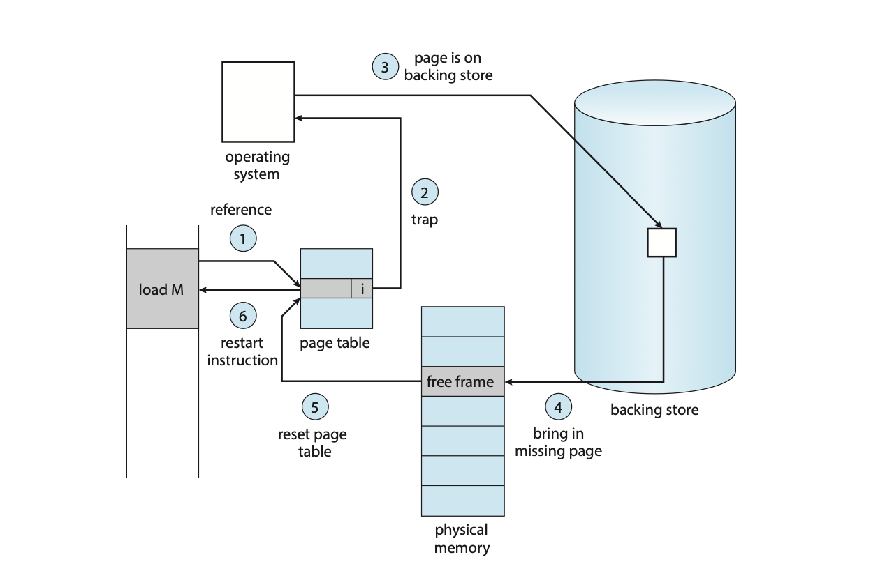

# Virtual Memory Manager (C)

Figure: Virtual Memory Manager - Handling Page Faults with Demand Paging.[1]

### Background
The Virtual Memory Manager program is one of the most popular projects in Operating Systems courses. During my task to create this Virtual Memory Manager, I noticed that there were no concise examples of code out there in the wild that properly modelled what was going on in the program. Because of this, I recreated the program from the ground up, avoiding the trap of copying and pasting code for the task, without actually understanding what was going on within the code.

### About the Virtual Memory Manager
The main purpose of this program is to translate logical addresses to physical addresses from a given file. The file contains a list of 1000 logical addresses, that aside from being translated, also needs to implement the <em>Demand Paging</em> algorithm of handling page faults. This implementation of the Virtual Memory Manager prioritizes modeling how the actual MMU (Memory Management Unit) works instead of performance. It also seeks to display the concept of MMU translation in the clearest way possible to any programmers or students trying to learn the concepts involved in translating logical to pyshical addresses and as well as the demand paging algorithm for handling page faults using extensive documentation.

### Implementation Summary
The main program’s implementation is split into five (5) main parts
- Open Required Files</strong> - the required files are opened using the <code>fopen</code> function, and the file descriptors are tested in error checking sequences if the files exist.
- Create Virtual Memory</strong> - a custom data type is implemented to represent the concept of virtual memory. In this step, we also read-in the input file, addresses.txt, into an address list.
- Create Physical Memory</strong> - a custom data type is implemented to represent the concept of physical memory, which is in the form of a contiguous memory location of type signed char. This physical memory is created with no pages in it in the beginning.
- Create Page Table</strong> - a custom data type is implemented to represent the concept of a page table. In this step, we initialize an array the size of the requirement (256) with the values -1. This represents a page table that does not have any mapping to frame numbers.
- Map Addresses and Generate Output</strong> - finally, we map all the virtual addresses we have and translate them to physical addresses. Whenever we have a missing mapping (page faults), we implement demand paging and copy in a page from the backing store file. Each translation is then recorded into an output file called ”output.txt”.

### References
[1] Silberschatz, Abraham, Peter B. Galvin, and Greg Gagne. Operating System Concepts, 10th Edition. Hoboken, NJ: Wiley, 2018.
